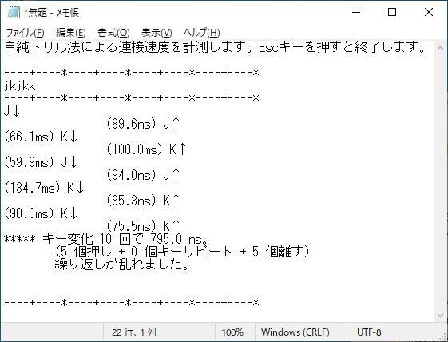

# 単純トリル法による連接速度を計測 (Windows)
## MesureKeyTrill.ahk
__Autohotkey.exe にドラッグするなどして実行します。__

[【薙刀式】トリルのみで測定してみた](http://oookaworks.seesaa.net/article/490449134.html#gsc.tab=0) 2022年8月8日付
の測定部分を Autohotkey で製作しました。

開かれたメモ帳でキーを押します。  
40字入力すると音と共にトレイチップが出ます。  
途中で繰り返しを間違えてもトレイチップが出ます。  
キーから手を離して約 1.05 秒経つとキーの名前と時間差が出力されます。

Escキーを入力すると終了します。
## 仕様
* キーフックを利用しています。測定誤差は 4ms 以内と予想しています。
* スクリプトをEXE化しても動かないようにしています。  
一度に大量のキーを押すとウイルス対策ソフトが反応することがあるので予防です。
## 動作確認
* Windows 10 Home version 20H2 + AutoHotkey (v1.1.34.03)
